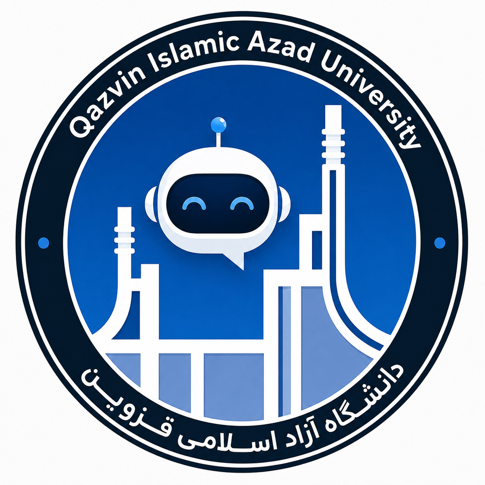

<p align="center">
  
</p>

# 🎓 QIAU Guide

> **🤖 An AI-powered Telegram student assistant for Qazvin Islamic Azad University (QIAU)**

     

QIAU Guide is a Bachelor's degree course project designed to provide university students with an intelligent Telegram chatbot that can answer questions using university-related data and Retrieval-Augmented Generation (RAG).

The project combines a Telegram bot, Large Language Models (LLMs), embedding models, a vector database, user memory, conversation history, and prompt engineering in a modular architecture.

---

## 📌 Overview

The main idea behind QIAU Guide is to create a university-oriented AI assistant that students can communicate with through Telegram.

Instead of relying only on the model's general knowledge, the chatbot retrieves relevant information from a dedicated university knowledge base and provides that information to the language model as context.

Examples of questions the bot is designed to answer include:

* "Is Professor X's class being held today?"
* "When is course registration?"
* "When is the add/drop period?"
* "How can I make a payment?"
* "What is the schedule for today?"

The current implementation primarily handles **text-based questions**. The architecture is intended to be extended to support files, multimodal inputs, and multimodal outputs in future versions.

---

## 🎯 Goals

The project was developed with several goals:

* Build a practical AI assistant for university students.
* Use RAG instead of relying exclusively on an LLM's internal knowledge.
* Keep university data separate from the language model itself.
* Add user-specific memory and conversation history.
* Use structured JSON output for extracting user information.
* Keep the model layer replaceable so different LLM/embedding providers can be used.
* Provide a foundation for future multimodal processing and automated data-processing features.
* Enable the system to eventually understand and use information contained in different file formats.

---

## ✨ Current Capabilities

### 💬 Student Question Answering

The bot receives text messages from Telegram and generates answers based on retrieved university-related information.

### 🔎 Retrieval-Augmented Generation

Relevant information is retrieved from a ChromaDB vector collection and passed to the language model as context.

### 🕐 Persian Date and Time Awareness

The user's message is processed together with Persian and Gregorian date/time information. This is important for time-dependent questions such as classes, registration dates, deadlines, and other announcements.

### 🧠 User Memory

The application maintains a separate JSON record for each Telegram user.

The stored structure contains:

* `user_id`
* `profile`
* `preferences`
* `conversation`

The project uses a second LLM process to extract useful information from user messages and return structured JSON.

example:
```json
{
    "user_id": "123456789",
    "profile": {
        "name": "John Doe",
        "major": "Computer Science",
        "location": "Qazvin"
    },
    "preferences": {},
    "conversation": [
        {
            "role": "user",
            "content": "سلام"
        },
        {
            "role": "assistant",
            "content": "سلام John Doe! 😊 چطور می‌تونم کمکتون کنم؟"
        },
        {
            "role": "user",
            "content": "زمان انتخاب واحد کی هست؟"
        },
        {
            "role": "assistant",
            "content": "زمان انتخاب واحد در اطلاعیه‌های دانشگاه اعلام می‌شود."
        }
    ]
}
```

### 💭 Conversation History

The bot stores conversation messages and uses recent history when generating subsequent responses.

The current implementation limits the conversation context sent to the model to the latest 20 messages in order to keep the context manageable.

### 🎛️ Prompt-Based Model Control

Two dedicated system prompts are used:

* `chat_prompt.txt` — controls the model responsible for generating the final answer.
* `info_prompt.txt` — controls the model responsible for extracting user information.

The information-extraction model is configured to return JSON.

---

## 🏗️ Architecture

The current architecture can be summarized as:

```text
                    ┌─────────────────────┐
                    │       Telegram      │
                    │        User         │
                    └──────────┬──────────┘
                               │
                               ▼
                    ┌─────────────────────┐
                    │     Telegram Bot    │
                    │(python-telegram-bot)|
                    └──────────┬──────────┘
                               │
                ┌──────────────┴──────────────┐
                │                             │
                ▼                             ▼
      ┌──────────────────┐          ┌──────────────────┐
      │ User Information │          │     Question +   │
      │    Extraction    │          │    Date + Time   │
      │      (LLM)       │          └────────┬─────────┘
      └────────┬─────────┘                   │
               │                             ▼
               ▼                    ┌──────────────────┐
      ┌──────────────────┐          │ Embedding Model  │
      │   User JSON      │          └────────┬─────────┘
      │  Memory/Profile  │                   │
      └──────────────────┘                   ▼
                                  ┌────────────────────┐
                                  │     ChromaDB       │
                                  │   Vector Database  │
                                  └─────────┬──────────┘
                                            │
                                            │ Retrieved Context
                                            ▼
                              ┌─────────────────────────┐
                              │        Chat LLM         │
                              │                         │
                              │ Prompt + User Profile   │
                              │ + Retrieved Context     │
                              │ + Conversation History  │
                              │ + Current Date/Time     │
                              └────────────┬────────────┘
                                           │
                                           ▼
                                  ┌──────────────────┐
                                  │  Telegram Answer │
                                  └──────────────────┘
```

---

## ⚙️ How the System Works

A typical request goes through the following steps:

### 1️⃣ Receive the message

The Telegram bot receives a text message from the user.

### 2️⃣ Identify the user

The application obtains the Telegram `user_id` and loads the corresponding user memory.

### 3️⃣ Extract user information

The message is sent to the information-extraction model.

If useful information is detected, such as a name, student number, city, field of study, or preference, it is returned as structured JSON and stored in the user's record.

### 4️⃣ Add temporal context

The application generates Persian and Gregorian date/time information and includes it in the retrieval query.

### 5️⃣ Retrieve relevant information

The question is converted into an embedding and searched against the ChromaDB collection.

The current implementation retrieves the closest matching records from the `telegram_messages` collection.

### 6️⃣ Build the LLM context

The final model receives a combination of:

* System prompt
* User profile and preferences
* Retrieved university data
* Previous conversation messages
* Current user message
* Current date and time

### 7️⃣ Generate the answer

The language model generates the final response.

### 8️⃣ Return the response

The generated answer is sent back to the student through Telegram.

---

## 🔄 Data Pipeline

The original university website was considered as a possible source of information. During development, however, a large portion of the available website content was found to be outdated or not sufficiently useful for the chatbot.

The project therefore uses exported messages from a university-related Telegram channel as its primary dataset.

The current data pipeline is:

```text
Telegram Channel Export
          │
          ▼
      Raw JSON
          │
          ▼
     clean_json()
          │
          ▼
clean_messages.json
          │
          ▼
   Embedding Model
          │
          ▼
      ChromaDB
          │
          ▼
     RAG Retrieval
```

Each cleaned message can contain information such as:

* Message ID
* Date
* Text
* File/media information
* A date-derived weight

The vector database uses the Telegram message ID as the document ID. During updates, existing IDs are checked so that newly exported messages can be added without re-embedding messages that are already present.

---

## 🧠 User Memory

A separate JSON file is created for each user:

```text
.Memory/
├── <user_id_1>.json
├── <user_id_2>.json
└── ...
```

A typical record has the following structure:

```json
{
    "user_id": "123456789",
    "profile": {},
    "preferences": {},
    "conversation": []
}
```

The information-extraction model is responsible for identifying profile/preference updates.

Conversation storage itself is handled by the application code rather than by the extraction model.

---

## 📝 Prompt System

The project uses two independent system prompts.

### 💬 `chat_prompt.txt`

Responsible for controlling the main conversational model.

It defines the rules the model should follow when generating answers.

### 🧾 `info_prompt.txt`

Responsible for extracting useful information from user messages.

The model is instructed to produce structured JSON so that the application can validate and store the extracted information.

This separation makes the two LLM tasks independent:

```text
User Message
     │
     ├──────────────► info_prompt
     │                    │
     │                    ▼
     │                 JSON Data
     │                    │
     │                    ▼
     │               User Memory
     │
     └──────────────► RAG + chat_prompt
                          │
                          ▼
                     Final Answer
```

---

## 📁 Project Structure

The current `main` branch contains the following main components:

```text
QIAU-Guide/
├── prompt/
│   ├── chat_prompt.txt
│   └── info_prompt.txt
│
├── uni_data/
│   ├── ...
│   └── chroma_db/
│
├── .gitignore
├── checklist.txt
├── logo.png
├── main.py
├── process_data.py
├── project_present.txt
└── requirements.txt
```

### 🐍 `main.py`

The main Telegram bot application.

Responsibilities include:

* Telegram message handling
* User identification
* User memory management
* Conversation history
* Date/time generation
* Information extraction
* RAG context retrieval
* LLM response generation
* Sending the final response to Telegram

### 🔄 `process_data.py`

Responsible for data processing and vector search.

It includes functionality for:

* Cleaning exported Telegram data
* Creating the ChromaDB vector database
* Updating the vector database
* Generating embeddings
* Performing embedding search
* Keyword-search groundwork
* Processing message metadata

---

## 🌿 Branches

The repository contains different development branches representing different model backends.

### 🟢 `main`

The main development branch.

At the current stage, its implementation corresponds to the local Ollama-based version.

### 🦙 `ollama`

A fully local version using Ollama for language-model and embedding operations.

Main advantage:

* No external LLM API cost

Main limitations:

* Hardware requirements
* Lower performance of lightweight local models, especially for Persian
* Slower inference on limited hardware

### ✨ `gemini`

A version designed around Google's Gemini API.

The language model and embedding layer can use Gemini services.

Main advantage:

* Higher-quality model output in testing
* Better Persian-language performance
* Cloud-based inference without requiring a powerful local machine

Main limitation:

* API usage cost

The architecture is intentionally designed so that changing the model backend does not require rewriting the overall application architecture.

---

## 🛠️ Technologies

The project currently uses technologies including:

| Technology            | Purpose                                  |
| --------------------- | ---------------------------------------- |
| Python                | Main programming language                |
| Telegram Bot API      | User communication                       |
| `python-telegram-bot` | Telegram bot implementation              |
| Ollama                | Local LLM/embedding backend              |
| Gemini API            | Cloud model backend in the Gemini branch |
| ChromaDB              | Vector database                          |
| Embedding Models      | Semantic representation and retrieval    |
| JSON                  | User memory and data exchange            |
| `jdatetime`           | Persian date/time handling               |
| `python-dotenv`       | Environment configuration                |
| BeautifulSoup         | Data/web processing utilities            |
| Requests              | HTTP/data retrieval utilities            |

---

## 📦 Requirements

The project requires Python and the dependencies listed in `requirements.txt`.

The current repository dependency file includes:

```text
beautifulsoup4
requests
python-dotenv
ollama
python-telegram-bot
jdatetime
```

The data-processing code also imports ChromaDB, so a working environment must have the ChromaDB package available as well.

For the local Ollama version, you also need:

* Ollama
* A suitable language model
* A suitable embedding model
* Sufficient RAM/CPU/GPU resources for the selected models

For the Gemini version, you need:

* A Gemini API key
* Access to the required Gemini models/services

---

## 🚀 Installation

### 1. Clone the repository

```bash
git clone https://github.com/Mani2OO5/QIAU-Guide.git
cd QIAU-Guide
```

### 2. Create a virtual environment

```bash
python3 -m venv .venv
source .venv/bin/activate
```

### 3. Install dependencies

```bash
pip install -r requirements.txt
```

Make sure ChromaDB is installed in environments where it is not already available:

```bash
pip install chromadb
```

### 4. Install and configure Ollama

Install Ollama according to your operating system, then pull the model you want to use.

The exact model is controlled by the environment configuration.

---

## ⚙️ Configuration

Create a `.env` file in the project root.

For the Ollama branch/main implementation:

```env
TELEGRAM_BOT_TOKEN=your_telegram_bot_token
OLLAMA_MODEL=your_ollama_model
```

Do not commit real tokens, API keys, or private credentials to GitHub.

The Gemini branch uses its corresponding API configuration.

---

## 🗃️ Preparing the Data

The data-processing workflow expects exported Telegram data to be placed in the appropriate `uni_data` location.

The processing script cleans the exported JSON and creates/updates the vector database.

The general workflow is:

```bash
python process_data.py
```

The script:

1. Reads the exported message data.
2. Cleans and normalizes messages.
3. Saves cleaned messages.
4. Checks existing vector IDs.
5. Embeds new messages.
6. Adds new embeddings to ChromaDB.

For the initial dataset, the vector database can be built from the cleaned messages. Later exports can be used to update the existing database instead of rebuilding it from scratch.

---

## ▶️ Running the Bot

After configuring the environment:

```bash
python main.py
```

The bot starts polling Telegram for new text messages.

The current implementation registers:

* `/start`
* Text message handling

Non-text media messages are not currently handled by the main message-generation flow.

---

## 📚 Data Source

One of the main challenges of the project was finding a reliable and sufficiently up-to-date university data source.

The university website was initially considered, but much of the available content was found to be outdated or not sufficiently useful for the intended assistant.

The project therefore uses exported messages from a university-related Telegram channel as its primary knowledge source.

At the current stage, updating the dataset is partly manual:

```text
Export new messages
        ↓
Clean data
        ↓
Update ChromaDB
```

The ideal future workflow is to automate this process.

---

## ⚠️ Limitations

The current implementation has several limitations.

### 🔄 Data Update

The dataset update process is not fully automated.

A future version should automatically detect and process new channel messages.

### 📡 Telegram API

Automatic collection of channel messages would require appropriate Telegram API credentials and an automated data-collection mechanism.

### 🖥️ Local LLM Performance

The Ollama version depends heavily on the available hardware.

On limited hardware, lightweight models may be slow and may produce lower-quality Persian responses.

### 💰 API Cost

The Gemini version provides a stronger cloud-based model backend, but API usage introduces operational costs.

### 📝 Text-Only Interaction

The current chatbot primarily processes text messages.

Images, videos, PDFs, documents, and other file types are not currently handled by the main message-generation flow.

### 🕒 Knowledge Freshness

The quality of the chatbot depends directly on the quality, completeness, and freshness of the underlying dataset.

---

## 🔮 Future Development

QIAU Guide is designed as a foundation that can be extended beyond the current text-based chatbot.

### 1️⃣ Automatic Data Collection

Replace the manual export/update workflow with an automated pipeline:

```text
Telegram Channel
       ↓
Automatic Collector
       ↓
New Message Detection
       ↓
Data Cleaning
       ↓
Embedding
       ↓
ChromaDB Update
```

The system could periodically check for new messages or react to newly published messages.

### 2️⃣ Automated File Processing

Extend the data pipeline so that the system can automatically process files attached to university messages.

Planned file types include:

* 🖼️ Images
* 📄 PDFs
* 🎥 Videos
* 📑 Documents
* 📦 Other common file formats

The future pipeline could extract text, metadata, visual information, or other relevant content from each file and convert the extracted information into searchable knowledge.

For example:

```text
Telegram Message
       │
       ├── Text ──────────────┐
       │                      │
       ├── Image ──► OCR/Vision
       │                      │
       ├── PDF ─────► Text Extraction
       │                      │
       ├── Video ───► Audio/Frame Analysis
       │                      │
       └── Document ─► Content Extraction
                              │
                              ▼
                     Processed Knowledge
                              │
                              ▼
                         Embeddings
                              │
                              ▼
                           ChromaDB
                              │
                              ▼
                         RAG Retrieval
```

This would allow the model to use information contained not only in text messages, but also in files such as **images, videos, PDFs, and documents** when answering student questions.

### 3️⃣ Multimodal Input

Add support for users sending different types of content directly to the bot, including:

* Images
* PDFs
* Videos
* Documents
* Other supported media

The system could analyze the submitted content and combine it with the existing RAG and conversation context.

### 4️⃣ Multimodal Output

The bot could return relevant files as answers.

For example:

```text
User:
"برنامه درسی امروز چیه؟"

Bot:
[Today's schedule image]
```

### 5️⃣ Better Retrieval

Future versions can improve retrieval by combining:

* Semantic/vector search
* Keyword search
* Metadata filtering
* Date-aware retrieval
* Re-ranking

This would be especially useful for questions containing exact names, dates, course codes, or administrative terminology.

### 6️⃣ Better Time-Aware Retrieval

The system can further improve handling of temporal questions by using message dates and metadata more explicitly.

This is useful for questions such as:

* Today's classes
* Registration deadlines
* Latest announcements
* Recent university notices

### 7️⃣ More Advanced Memory

The current profile/preferences memory can evolve into a more structured user profile system.

Possible future data could include:

* Academic information
* User preferences
* Frequently asked topics
* Relevant personal context

### 8️⃣ Model Abstraction

The model layer can be further abstracted so that the same application can switch between:

```text
Ollama
Gemini
Other LLM Providers
Future Local Models
```

without changing the Telegram/RAG/memory architecture.

### 9️⃣ Production Deployment

For a real university-scale deployment, the project could eventually include:

* Persistent server deployment
* Database-backed user storage
* Authentication/authorization
* Logging and monitoring
* Error handling
* Rate limiting
* Automated backups
* Automated data ingestion
* Model/API fallback
* Evaluation and testing pipelines

---

## 📊 Project Status

### 🟢 Current

* [x] Telegram text chatbot
* [x] LLM-based response generation
* [x] RAG architecture
* [x] ChromaDB vector storage
* [x] Embedding-based retrieval
* [x] Persian date/time context
* [x] User-specific JSON memory
* [x] Conversation history
* [x] Separate chat and information prompts
* [x] Local Ollama implementation
* [x] Gemini-based implementation
* [x] Incremental vector database update

### 🔮 Planned

* [ ] Automated Telegram data collection
* [ ] Fully automated data update pipeline
* [ ] Automated processing of images, PDFs, videos, and documents
* [ ] Multimodal input
* [ ] Multimodal output
* [ ] Improved hybrid retrieval
* [ ] Improved metadata/date filtering
* [ ] More advanced memory
* [ ] Production deployment
* [ ] Automated evaluation
* [ ] Better model/backend abstraction

---

## 🎓 Academic Context

QIAU Guide was developed as a **Bachelor's degree course project** in Computer Engineering.

The project was designed not only as a Telegram chatbot, but as an exploration of practical LLM application development, including:

* Retrieval-Augmented Generation
* Vector databases
* Embedding models
* Prompt engineering
* LLM-based information extraction
* User memory
* Conversational context
* Local LLM deployment
* Cloud LLM APIs
* Data processing pipelines
* Telegram bot development

The project demonstrates how these components can be combined into a practical AI application rather than using a language model as a standalone chatbot.

---

## 👨🏻‍💻 Author

**Mani Arab**

Bachelor's Degree in Computer Engineering

Qazvin Islamic Azad University

---

## 📄 License

This project is licensed under the **MIT License**.

See the `LICENSE` file for the full license text.
